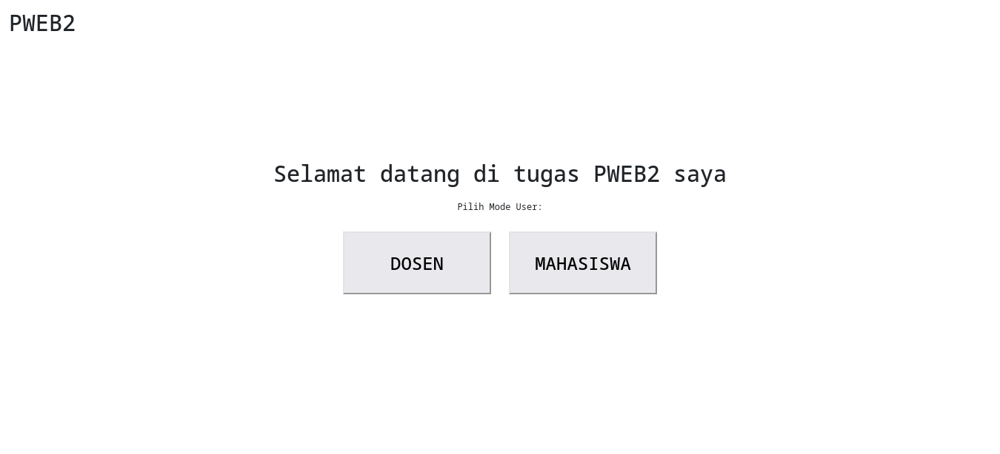

# Tugas 2 Praktikum Pemrograman Web 2

## Task:

1. Create an OOP-based View, by retrieving data from the MySQL database
2. Use the \_\_construct as a link to the database
3. Apply encapsulation according to the logic of the case study
4. Create a derived class using the concept of inheritance
5. Apply polymorphism for at least 2 roles according to the case study

## 1. Create an OOP-based View, by retrieving data from the MySQL database

class Koneksi yang bertanggung jawab untuk menghubungkan ke database MySQL menggunakan mysqli. Pada konstruktor \_\_construct(), koneksi ke database dilakukan, sehingga class ini dapat digunakan sebagai dasar untuk berinteraksi dengan database di kelas-kelas lainnya.

```php
class Koneksi
{
    private $host = "localhost";
    private $username = "root";
    private $password = "";
    private $dbname = "pwebTugas2";

    public function __construct()
    {
        $db = new mysqli($this->host, $this->username, $this->password, $this->dbname);

        return $db;
    }

}
```

## 2. Use the \_\_construct as a link to the database

konstruktor `__construct()` bertindak sebagai titik awal untuk menghubungkan ke database MySQL. Setiap kali instance dari class ini dibuat, koneksi ke database secara otomatis dilakukan.

```php
public function __construct()
    {
        $db = new mysqli($this->host, $this->username, $this->password, $this->dbname);

        return $db;
    }
```

## 3. Apply encapsulation according to the logic of the case study

Enkapsulasi digunakan dengan cara menjadikan properti database (`$host`, `$username`, `$password`, `$dbname`) bersifat private. Hal ini bertujuan agar properti tersebut tidak dapat diakses langsung dari luar class dan hanya bisa diakses melalui fungsi dalam class.

```php
    private $host = "localhost";
    private $username = "root";
    private $password = "";
    private $dbname = "pwebTugas2";
```

## 4. Create a derived class using the concept of inheritance

class abstract Operasi yang mewarisi class Koneksi. Class Operasi ini berfungsi sebagai tempat untuk operasi database seperti `selectAll`,`selectByNama`, `selectAllJoin`, `selectByNamaJoin`, dll. Dengan konsep inheritance, class Operasi dapat menggunakan koneksi yang telah dibuat oleh class Koneksi.

```php
<?php
class Koneksi
{
    private $host = "localhost";
    private $username = "root";
    private $password = "";
    private $dbname = "pwebTugas2";

    public function __construct()
    {
        $db = new mysqli($this->host, $this->username, $this->password, $this->dbname);

        return $db;
    }

}

abstract class Operasi extends Koneksi
{
    public function selectAll($table)
    {
        $query = "select * from $table";
        return parent::__construct()->query($query);
    }

    public function selectAllJoin()
    {
        $query = "select * from mahasiswa join nilai_perbaikan on mahasiswa.mahasiswa_id=nilai_perbaikan.mahasiswa_id";
        return parent::__construct()->query($query);
    }

    public function selectByNamaJoin($nama)
    {
        $query = "select * from mahasiswa join nilai_perbaikan on mahasiswa.mahasiswa_id=nilai_perbaikan.mahasiswa_id where nama_mhs='$nama'";
        return parent::__construct()->query($query);
    }
    public function selectByName($table, $nama)
    {
        $query = "select * from $table where nama_mhs='$nama'";
        return parent::__construct()->query($query);
    }

    abstract function tblMahasiswa();
    abstract function tblNilaiPerbaikan();
}
```

## 5. Apply polymorphism for at least 2 roles according to the case study

Polimorfisme diterapkan dengan membuat beberapa class turunan (Mahasiswa dan Dosen) yang mewarisi class Operasi. Keduanya memiliki metode tblMahasiswa() dan tblNilaiPerbaikan(), namun dengan implementasi yang berbeda sesuai dengan kebutuhan masing-masing.

Contoh penerapan polimorfisme:

- Class `Mahasiswa` menerapkan tblMahasiswa() dan tblNilaiPerbaikan() untuk menampilkan data mahasiswa tertentu yang dicari.
- Class `Dosen` menerapkan metode yang sama namun menampilkan semua data mahasiswa dan nilai perbaikan.

```php
<?php
class Mahasiswa extends Operasi
{
    public function tblMahasiswa()
    {
        if (isset($_GET['nama'])) {
            $data = $this->selectByName("mahasiswa", $_GET['nama']);
            $i = $data->fetch_assoc();
        }
        ?>
        <!-- Button trigger modal -->
        <button type="button" class="btn btn-primary" data-bs-toggle="modal" data-bs-target="#exampleModal">
            Cari Data Mahasiswa
        </button>
        <!-- Button trigger modal -->

        <!-- Modal -->
        <form action="search.php?menu=mahasiswa" method="POST">
            <div class="modal fade" id="exampleModal" tabindex="-1" aria-labelledby="exampleModalLabel" aria-hidden="true">
                <div class="modal-dialog modal-dialog-centered">
                    <div class="modal-content">
                        <div class="modal-header">
                            <h1 class="modal-title fs-5" id="exampleModalLabel">Cari Mahasiswa</h1>
                            <button type="button" class="btn-close" data-bs-dismiss="modal" aria-label="Close"></button>
                        </div>
                        <div class="modal-body">

                            <input type="text" class="w-100" name="nama">

                        </div>
                        <div class="modal-footer">
                            <button type="button" class="btn btn-secondary" data-bs-dismiss="modal">Close</button>
                            <button type="submit" class="btn btn-primary">Cari</button>
                        </div>
                    </div>
                </div>
            </div>
        </form>
        <!-- Modal -->
        <table class="table w-80">
            <tr>
                <th>NIM</th>
                <th>Nama</th>
                <th>Email</th>
                <th>No.Telp</th>
            </tr>
            <?php
            if (isset($_GET['nama'])) {
                ?>
                <tr>
                    <td>
                        <?= $i['nim'] ?>
                    </td>
                    <td>
                        <?= $i['nama_mhs'] ?>
                    </td>
                    <td>
                        <?= $i['email'] ?>
                    </td>
                    <td>
                        <?= $i['no_telp'] ?>
                    </td>
                </tr>
                <?php
            } else {
                ?>
                <tr>
                    <td colspan="4">CARI DATA/ DATA TIDAK DITEMUKAN </td>
                </tr><?php
            }
            ?>
        </table><?php
    }

    public function tblNilaiPerbaikan()
    {
        if (isset($_GET['nama'])) {
            $data = $this->selectByNamaJoin($_GET['nama']);
            $i = $data->fetch_assoc();
        }
        ?>
        <!-- Button trigger modal -->
        <button type="button" class="btn btn-primary" data-bs-toggle="modal" data-bs-target="#exampleModal">
            Cari Data Mahasiswa
        </button>
        <!-- Button trigger modal -->

        <!-- Modal -->
        <form action="search.php?menu=perbaikanNilai" method="POST">
            <div class="modal fade" id="exampleModal" tabindex="-1" aria-labelledby="exampleModalLabel" aria-hidden="true">
                <div class="modal-dialog modal-dialog-centered">
                    <div class="modal-content">
                        <div class="modal-header">
                            <h1 class="modal-title fs-5" id="exampleModalLabel">Cari Mahasiswa</h1>
                            <button type="button" class="btn-close" data-bs-dismiss="modal" aria-label="Close"></button>
                        </div>
                        <div class="modal-body">

                            <input type="text" class="w-100" name="nama">

                        </div>
                        <div class="modal-footer">
                            <button type="button" class="btn btn-secondary" data-bs-dismiss="modal">Close</button>
                            <button type="submit" class="btn btn-primary">Cari</button>
                        </div>
                    </div>
                </div>
            </div>
        </form>
        <!-- Modal -->
        <table class="table w-80">
            <tr>
                <th>Tanggal Perbaikan</th>
                <th>Keterangan</th>
                <th>Nama Mahasiswa</th>
                <th>Matkul</th>
                <th>Semester</th>
                <th>Nilai</th>
                <th>Dosen</th>
            </tr>
            <?php
            if (isset($_GET['nama'])) {
                ?>
                <tr>
                    <td>
                        <?= $i['tgl_perbaikan'] ?>
                    </td>
                    <td>
                        <?= $i['keterangan'] ?>
                    </td>
                    <td>
                        <?= $i['nama_mhs'] ?>
                    </td>
                    <td>
                        <?= $i['matkul'] ?>
                    </td>
                    <td>
                        <?= $i['semester'] ?>
                    </td>
                    <td>
                        <?= $i['nilai'] ?>
                    </td>
                    <td>
                        <?= $i['dosen'] ?>
                    </td>
                </tr>
                <?php
            } else {
                ?>
                <tr>
                    <td colspan="4">CARI DATA/ DATA TIDAK DITEMUKAN </td>
                </tr><?php
            }
            ?>
        </table><?php
    }
}

class Dosen extends Operasi
{
    public function tblMahasiswa()
    {
        $data = $this->selectAll("mahasiswa");
        ?>
        <table class="table w-80">
            <tr>
                <th>NIM</th>
                <th>Nama</th>
                <th>Email</th>
                <th>No.Telp</th>
            </tr>
            <?php
            foreach ($data as $i) {
                ?>
                <tr>
                    <td>
                        <?= $i['nim'] ?>
                    </td>
                    <td>
                        <?= $i['nama_mhs'] ?>
                    </td>
                    <td>
                        <?= $i['email'] ?>
                    </td>
                    <td>
                        <?= $i['no_telp'] ?>
                    </td>
                </tr>
                <?php
            }
            ?>
        </table>
        <?php
    }

    public function tblNilaiPerbaikan()
    {
        $data = $this->selectAllJoin();
        ?>
        <table class="table w-80">
            <tr>
                <th>Tanggal Perbaikan</th>
                <th>Keterangan</th>
                <th>Nama Mahasiswa</th>
                <th>Matkul</th>
                <th>Semester</th>
                <th>Nilai</th>
                <th>Dosen</th>
            </tr>
            <?php
            foreach ($data as $i) {
                ?>
                <tr>
                    <td>
                        <?= $i['tgl_perbaikan'] ?>
                    </td>
                    <td>
                        <?= $i['keterangan'] ?>
                    </td>
                    <td>
                        <?= $i['nama_mhs'] ?>
                    </td>
                    <td>
                        <?= $i['matkul'] ?>
                    </td>
                    <td>
                        <?= $i['semester'] ?>
                    </td>
                    <td>
                        <?= $i['nilai'] ?>
                    </td>
                    <td>
                        <?= $i['dosen'] ?>
                    </td>
                </tr>
                <?php
            }
            ?>
        </table>
        <?php

    }
}
```

## HASIL:

### Halaman Utama:



### Halaman Menu:


### Halaman Data / Tabel:

#### Mode Dosen

Mode Dosen menampilkan semua data mahasiswa dan nilai perbaikan.

##### Tabel Mahasiswa:


##### Tabel Nilai Perbaikan:


#### Mode Mahasiswa

Mode Mahasiswa hanya menampilkan data mahasiswa tertentu yang dicari.

##### Tabel Mahasiswa:


##### Tabel Nilai Perbaikan:


